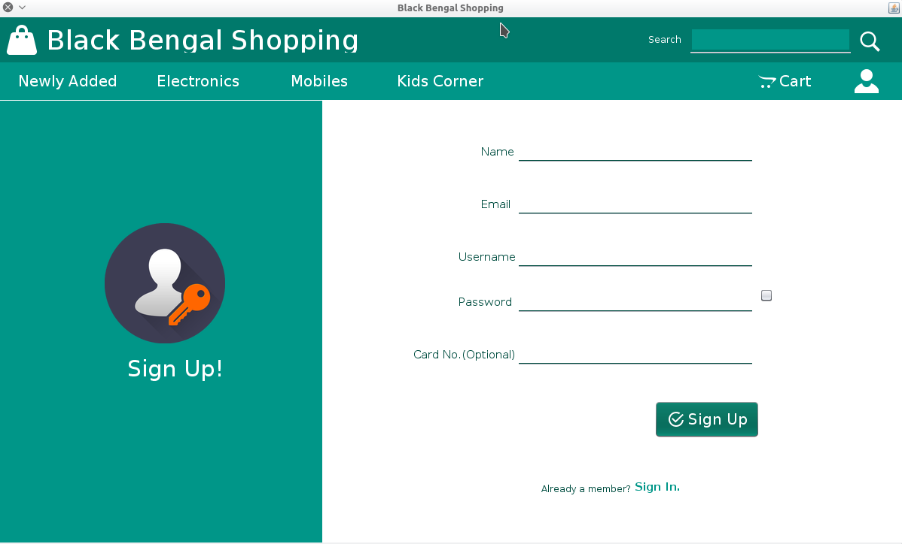

**This is a sample project on Shopping Cart using Java SE and sqlite DB.** 

**Sample Screenshot:**

**Project Video:**
[https://www.youtube.com/watch?v=jTnqAGxYsII](https://www.youtube.com/watch?v=jTnqAGxYsII)

**Features:**

- Cart  
-   Category Wise Panels  
-   Sign Up/Sign In   
-   Password Recovery 
-   New Product Entry   
-   Stock Update   
-   Billing details etc.

**CAUTION:**
- THIS PROJECT IS DEVELOPED ON WINDOWS ENVIRONMENT AND NETBEANS IDE 8.2 
- INCLUDED JAR FILES SHOULD BE IMPORTED TO IDE(Location: Project/lib)
- FOR PICTURES THERE ARE THREE DIFFERENT FOLDERS IN 'Project/src/products' AS PER CATEGORY. 
- FOR NEW ENTRY, NEW PICTURES SHOULD   BE PLACED AS PER THEIR CATEGORY.
- TO SIGN INTO ADMIN PANEL SIGN IN AS "username: admin, password: admin"
